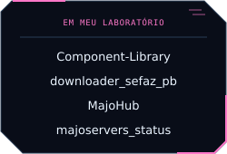
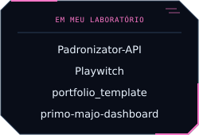
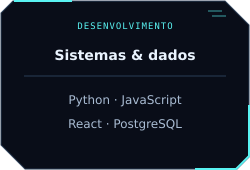

  <a href="#projetos">Projetos</a> · <a href="#tecnologias">Tecnologias</a> · <a href="https://github.com/Majozin?tab=repositories">Repositórios públicos</a>

<h2 align="center">Projetos</h2>

<!-- PRIVATE_PROJECTS_START -->

<h4 align="center">Outros projetos · sem estimativa</h4>

<!-- PRIVATE_PROJECTS_END -->

<h2 align="center">Tecnologias</h2>

