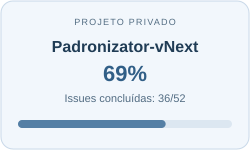
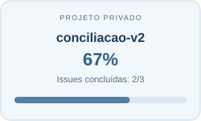

  

  

<h3 align="center">Meu laboratório de ideias que saem do papel.</h3>

Aqui reúno projetos que nascem de necessidades reais e da vontade de experimentar. Entre sistemas de gestão, integrações e infraestrutura self-hosted, aprendo construindo e aprimoro usando.

  <a href="#projetos">Projetos</a> · <a href="#tecnologias">Tecnologias</a> · <a href="https://github.com/Majozin?tab=repositories">Repositórios públicos</a>

<h2 align="center">Projetos</h2>

<!-- PRIVATE_PROJECTS_START -->

<h4 align="center">Outros projetos · sem estimativa</h4>

<code>Component-Library</code> · <code>downloader_sefaz_pb</code> · <code>MajoHub</code> · <code>majoservers_status</code> · <code>Padronizator-API</code> · <code>Playwitch</code> · <code>portfolio_template</code> · <code>primo-majo-dashboard</code> · <code>RealmOps</code> · <code>UniSefazPB</code> · <code>zimaos</code>

<!-- PRIVATE_PROJECTS_END -->

<h2 align="center">Tecnologias</h2>

  <strong>Desenvolvimento &amp; dados</strong> 
  Python · JavaScript · React · PostgreSQL

  <strong>Infraestrutura &amp; automação</strong> 
  Docker · Linux · Git · GitHub Actions · Cloudflare

  <strong>Design &amp; prototipação</strong> 
  Figma · Penpot · Interfaces &amp; experiência do usuário

Planejar com clareza. Construir com propósito. Aprimorar sempre.

